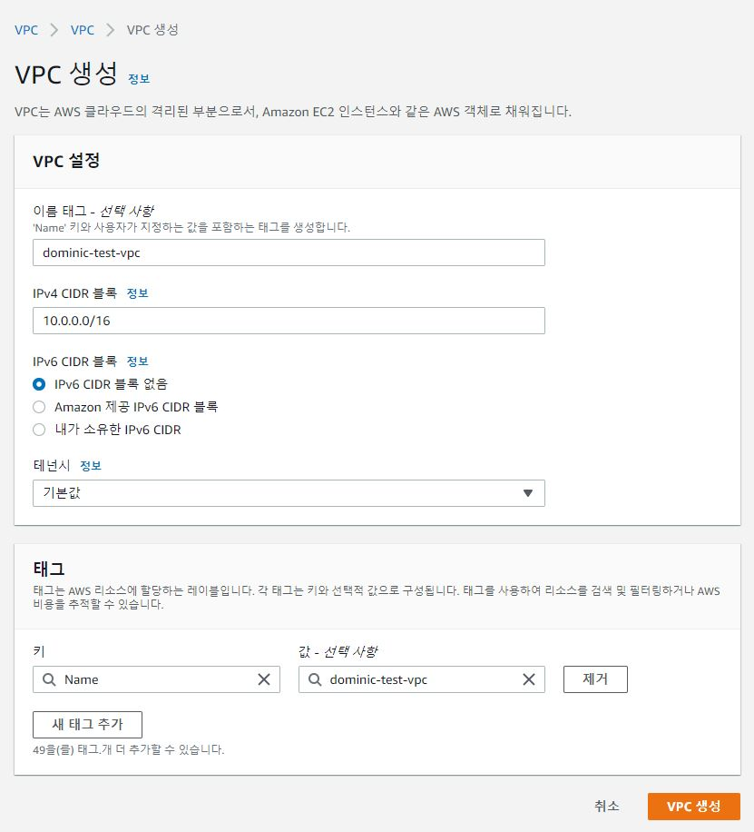
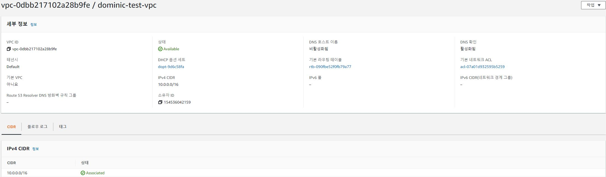
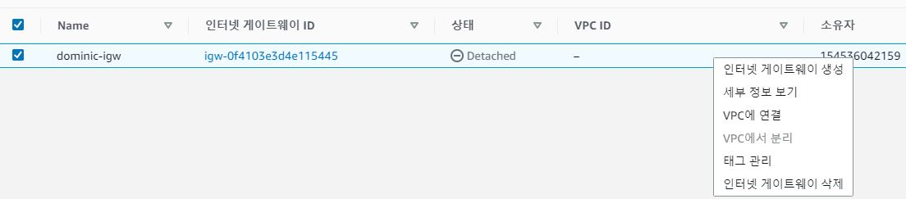
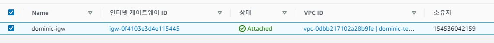
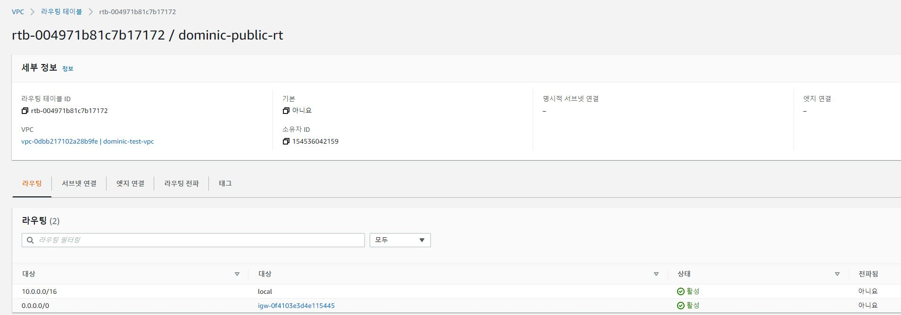

AWS를 사용하시려는 모든 유저분들이 간단히 보기에 좋은 내용입니다. AWS Docs는 너무 어려워...! 그렇다면 들어오세요.

<!--more-->

## 배경
AWS를 시작하시는 분들을 위해 간단하게 VPC 서비스에 대해 정리해보았습니다.

### VPC 개념 (Virtual Private Cloud) (AKA. VPC)
AWS 내 네트워크 입니다. 사용자가 정의한 가상 네트워크 내 다양한 서비스 가령 EC2등의 서버를 올리는 등, AWS의 네트워크 인프라를 구축할 수 있습니다.
### VPC 구성요소 
#### Virtual Private Cloud(VPC)
  사용자의 AWS 계정 전용 가상 네트워크입니다. 논리적으로 분리되어있습니다.
  AWS 계정을 생성하면 기본적으로 Default VPC를 제공받게 되는데, 이를 활용하셔도되고 직접 VPC를 생성하셔서 사용하셔도 됩니다.

- VPC를 생성하고자 한다면 IPv4 Cidr값을 설정해야합니다. (예시 10.0.0.0/16)

- 생성 직후 VPC정보 입니다. 항목별 내용은 아래 기재해두겠습니다.

#### Tenancy
전용 테넌시는 VPC에서 시작된 모든 EC2 인스턴스가 단일 고객 전용 하드웨어에서 실행되도록합니다.
하드웨어를 예약해두고 쓴다라는 개념입니다. 그렇기에 비용이 발생합니다.
기본으로 설정할 경우 해당 리전의 AWS 하드웨어의 어딘가에 리소스들이 생성되는 로직입니다.

보안에 민감한 서비스의 경우거나, 리소스를 선점하고 사용하려할 때 혹은 라이센스 이슈로 인해 전용호스트가 필요할 경우가 사용하는 옵션입니다.

#### Subnet 
  VPC의 대역을 subneting하여 분리한 공간입니다. 보조 Cidr 대역이라고 생각하면 될거같습니다.

  RFC 1918 규격에 맞춰 사설 IP대역을 나눠주는게 좋습니다. 
  각 서브넷 CIDR 블록에서 첫 4개의 IP 주소와 마지막 IP 주소는 사용자가 사용할 수 없으므로 인스턴스에 할당할 수 없습니다. 
  
  예를 들어 10.0.0.0/24 CIDR 블록의 서브넷에서는 다음 5개 IP 주소가 예약되어 있습니다.

  -  10.0.0.0: 네트워크 주소.

  -  10.0.0.1: AWS에서 VPC 라우터용으로 예약한 주소.

  -  10.0.0.2: AWS에서 예약한 주소 DNS 서버의 IP 주소는 기본 VPC 네트워크 범위에 2를 더한 주소입니다. CIDR 블록이 여러 개인 VPC의 경우, DNS 서버의 IP 주소가 기본 CIDR에 위치합니다. 또한 각 서브넷 범위의 기본에 2를 더한 주소를 VPC의 모든 CIDR 블록에 대해 예약합니다. 자세한 내용은 Amazon DNS 서버 단원을 참조하세요.

  -  10.0.0.3: AWS에서 앞으로 사용하려고 예약한 주소.

  -  10.0.0.255: 네트워크 브로드캐스트 주소. VPC에서는 브로드캐스트를 지원하지 않으므로, 이 주소를 예약합니다.
        
        
아까 만들어둔 VPC(10.0.0.0/16)에서 서브넷을 나눠 봅시다.

- 두개의 서브넷을 만들었습니다. (10.0.10.0/24, 10.0.20.0/24)

#### Routing Table
VPC 내 트래픽들의 라우팅 규칙을 설정해야합니다.
Routing Table은 기본적으로 VPC에 종속되어 VPC 내 Subnet대역의 라우팅을 결정합니다.
기본적으로 VPC를 생성하면 VPC 대역 내 local 통신을 허용한 상태로 생성됩니다.
이러한 라우팅 테이블에 서브넷을 연결해주어 local 통신만 하는 대역 (Private)과 외부 통신을 하는 대역(Public)등 목적에 맞게 구성합니다.

private, public 라우팅 테이블을 생성하여 서브넷을 할당해봅시다.

- 위 예시처럼 총 3개의 라우팅 테이블 (기본 1, 생성 2)이 만들어졌습니다. 라우팅 규칙 추가는 뒤에서 이어하곘습니다.

#### Internet Gateway (AKA. igw)
VPC의 리소스와 인터넷 간의 통신을 활성화하기 위해 VPC에 연결하는 게이트웨이입니다.
igw를 생성하여 라우팅 테이블의 경로를 지정해주면 해당 라우팅 테이블에 연결되어있는 서브넷은 트래픽이 igw를 타고 외부와 통신할 수 있게 됩니다.

 

 

- igw를 생성하면 Detached상태로 생성됩니다. 이를 VPC에 연결하여 할당해주면 라우팅테이블에서 리소스를 확인 할 수 있습니다.

라우팅 테이블 경로에 추가하였습니다. 이 라우팅 테이블에 연결된 서브넷들은 이제 외부와 통신이 가능하게 됩니다.

#### NAT Gateway
외부와의 연결이 없는 상태의 Private Subnet에서 외부와의 통신이 필요할 때 사용합니다.
AWS NAT Gateway 서비스는 내부에서 외부 접근은 가능하지만, 외부에서 내부 접근은 불가능한 SNAT 동작을 합니다.
인터넷으로 나가는 패킷의 Source IP를 NAT Gateway의 Public IP로 바꿔 통신이 가능합니다.

외에도 인스턴스를 NAT화 시켜 사용하는 방법도 있습니다. (관리의 차이)

만약 여러 가용 영역에 리소스가 있고 NAT 게이트웨이 하나를 공유하는 경우, NAT 게이트웨이의 가용 영역이 다운되면 다른 가용 영역의 리소스도 인터넷에 액세스할 수 없게 됩니다. 가용 영역과 독립적인 아키텍처를 만들려면 각 가용 영역에 NAT 게이트웨이를 만들고 리소스가 동일한 가용 영역의 NAT 게이트웨이를 사용하도록 라우팅을 구성합니다.

#### VPC Endpoint 
인터넷 게이트웨이, NAT 디바이스, VPN 연결 또는 AWS Direct Connect 연결 없이도 PrivateLink로 구동하는 지원되는 AWS 서비스 및 VPC 엔드포인트 서비스에 비공개로 연결할 수 있게 합니다. 예를 들어 S3 통신에 사용할 수도 있습니다.
VPC의 인스턴스는 서비스의 리소스와 통신하는 데 퍼블릭 IP 주소를 필요로 하지 않습니다. 기본적으로 VPC와 기타 서비스 간의 트래픽은 Amazon 네트워크를 벗어나지 않습니다. 

#### DHCPset
기본적으로 기본 VPC가 아닌 VPC에 있는 모든 인스턴스는 AWS가 배정하는 확인할 수 없는 호스트 이름을 수신합니다(예: ip-10-0-0-202). 인스턴스에 자체 도메인 이름을 배정하고 최대 4개의 자체 DNS 서버를 사용할 수 있습니다.

또한 기본 Amazon DNS 서버를 통해 인스턴스에 Private DNS hostname을 할당 받을 수 있습니다. 

### VPC 요금 
VPC 구성은 별도의 비용이 발생하지 않습니다. 다만 트래픽 미러링이나 VPC flowlog등 별도의 서비스들에 대해서는 비용이 발생합니다. (비쌉니다.)

### 결론
VPC를 구성하는 것은 하나의 인프라를 구축함에 있어 기반을 다지는 것과 마찬가지입니다.
최대한 느슨한 구조로 아키텍쳐링하셔야 나중에 수정할 때 편합니다.
