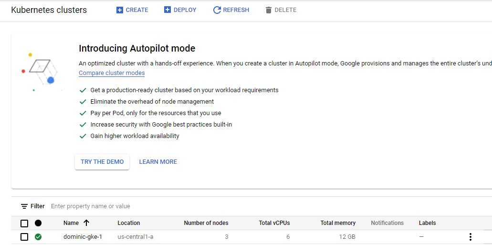
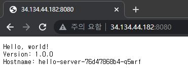
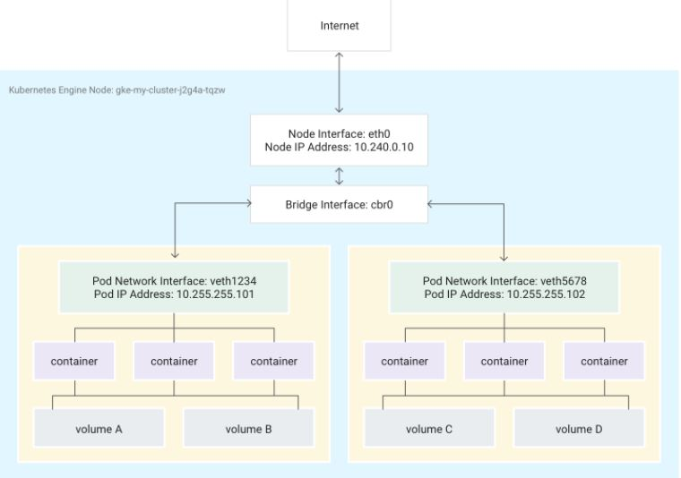

CKA 취득을 위해 이론적으로 공부한 내용들을 간단하게 기록하였습니다.
<!--more-->
### GKE(google Kubernetes Engine)

기존 쿠버네티스와 동일하게 Master(Control Plane)과 Worker Node로 구성되어있으며, GCP 관리형 서비스이기에 노드 확장 등의 편리함이 있다. (arg. AWS EKS...)
그저, 위치와 k8s 버전, Network (VPC) 환경과 IP 대역만 설정하면 내부에 알아서 k8s cluster를 생성해준다.

#### node pool
node에 대한 위치, 수량, 스펙, 운영체제, 셀프힐링, 노드 업그레이드 정책, 최대 Pod/node 갯수를 선택한다.

### GKE 클러스터 생성
세상이 이렇게 좋아졌다. 짧은 CLI 한줄로 GKE 클러스터를 생성할 수 있다.

```
gcloud container clusters create dominic-gke-1

<---결과값--->
kubeconfig entry generated for dominic-gke-1.
NAME           LOCATION       MASTER_VERSION   MASTER_IP     MACHINE_TYPE  NODE_VERSION     NUM_NODES  STATUS
dominic-gke-1  us-central1-a  1.19.9-gke.1900  비-밀-임       e2-medium   1.19.9-gke.1900        3      RUNNING

```


3대의 노드로 이뤄진 GKE가 생성되었다. 클러스터 사용자 인증 정보가 필요하다.

### GKE 클러스터 인증정보 갱신

```
gcloud container clusters get-credentials dominic-gke-1
```

이제 GKE 셋팅은 완료하였으니, 뭐라도 배포해보자 제일 좋아하는 Hello, world를...kubtctl create deployment를 통해 새 배포를 만들어준다.

### GKE deplotyment

```
kubectl create deployment hello-server --image=gcr.io/google-samples/hello-app:1.0
```

배포가 정상적으로 이뤄졌다면 파드가 올라와있는지 확인해보자.

```
kubectl get pod -o wide

<---결과값--->
NAME                            READY   STATUS    RESTARTS   AGE    IP          NODE                                           NOMINATED NODE   READINESS GATES
hello-server-76d47868b4-q5mrf   1/1     Running   0          109s   10.40.0.6   gke-dominic-gke-1-default-pool-601c4b2c-tqvk   <none>           <none>
```

파드가 **gke-dominic-gke-1-default-pool-601c4b2c-tqvk**라는 노드에 배포되어 1개의 컨테이너가 잘 실행되어있다. 

### GKE expose serivce

kubectl expose 명령어로 서비스를 노출해서 체크해보자

```
kubectl expose deployment hello-server --type=LoadBalancer --port 8080

<---결과값--->
service/hello-server exposed
```

kubectl get service로 확인해보면

```
kubectl get services

<---결과값--->
NAME           TYPE           CLUSTER-IP      EXTERNAL-IP   PORT(S)          AGE
hello-server   LoadBalancer   10.43.246.172   <pending>     8080:32709/TCP   33s
```

생성한 service의 IP를 알 수 있다. ~~아직 Pending이면 우선 기다려보자.~~ 내 서비스 LB의 IP는 34.134.44.184다.

### GKE service test



이렇게 외부에서 8080 포트를 통해 접근했을 때, 파드 내 컨테이너의 Hello, world web이 접근되는걸 볼 수 있다.

깔끔하다. CNI도 고민없이 그냥 GKE의 CNI를 사용했다.

### GKE 기본 CNI 환경
\
GKE의 CNI를 사용하는 경우 가상 이더넷 기기(veth) 쌍의 한쪽 끝은 네임스페이스의 pod에 연결되고 다른 한쪽 끝은 Linux 브리지 기기 cbr0에 연결된다.

이 경우 다음 명령어를 실행하면 cbr0에 연결된  pod의 MAC 주소가 표시된다.
```
arp -n
```

또한 이전 k8s-network에서 확인했듯이 brctl 명령어를 통해 cbr0에 연결된 각 veth 쌍의 루트 네임스페이스가 확인된다.
```
brctl show cbr0
```




 GKE를 한번 써본 것으로 좀 더 kube~명령어에 익숙해진 느낌이랄까...😅😅

~~기분탓일지도 모른다.~~

일단 CKA는 기간이 조금 남았으니, 스케줄을 잘 조절해서 한방에 취득해보자...