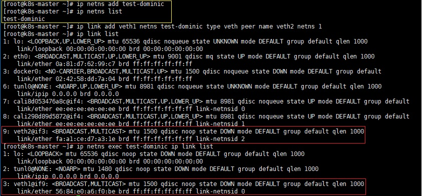

CKA 취득을 위해 이론적으로 공부한 내용들을 간단하게 기록하였습니다.
<!--more-->

## 배경
컨테이너 Network부터 Pod Network까지 이론정리

### Docker Networking
- 격리된 환경에서 실행되는 하나의 **프로세스**
- 위에서 격리된 환경을 구현하는 기술은 chroot, cgroups, namespace
  - namespace : 네트워크인터페이스, 라우팅, 방화벽 규칙들을 격리한다. 이런 namespace로 인해 격리된 PID들은 veth를 통해 연결한다.
  - veth : linked virtual ethernet device pair = 항상 쌍 (pair)로 생성되어 연결된 상태를 유지한다.

직접 Namespace를 생성해보자.

local namespace와 ipnetns add를 통해 만든 namespace에 veth를 붙여봤다.

컨테이너를 새로이 배포할때마다 컨테이너에게 veth0라는 가상 네트워크 인터페이스를 할당하여 docker0에 연결,
linked virtual ethernet device pair로 컨테이너와 bridge를 연결한다.

- 도커 설치 직후 상태 
#### bridge Network

결국 컨테이너 네트워크 인터페이스 (Namesapce 내 veth)들은 bridge(docker0 : docker 시작시 기본적으로 생성되는 bridge)를 통해 연결되어 하나의 세그먼트로 구성되지만, 같은 bridge에 연결되지 않은 컨테이너들은 격리된 공간을 유지한다.

**[eth0 -> docker0(bridge) -> veth0(host) <-[pairing]-> veth0(container) -> container]**

위 이미지에서 bridge의 subnet과 Gateway를 보고 밑에 container의 IP를 보면 확실하다.

아니면 brctl show 명령어를 통해 bridge에 연결되어있는 Interface에 veth를 확인하면 된다.

default bridge 말고, custom bridge를 생성하여 별도의 네트워크 구성도 물론 가능하다고 하지만, 해보진 않았으므로 잠시 미뤄두겠다.

#### Host Networking

Host에서 사용하고 있는 네트워크를 그대로 컨테이너가 사용한다. 

그렇기 떄문에 컨테이너에 IP(veth)를 할당하지 않기에 bridge에 바인딩이 되지 않는다.

#### overlay Networking

다른 도커 데몬 host의 container와 통신하기 위해 보통 OS레벨에서의 라우팅이 필요하지만, Overlay 네트워크를 사용하여 분산 네트워크(arg. Swarm service)를 구성할 수 있다.

#### none Networking
none : 모든 네트워킹 드라이버, 그 어떠한 인터페이스도 없는 설정이다. 보통 커스텀 네트워크 드라이버를 구성할 경우 사용한다.

#### macvlan, ipvlan Networking
말그대로 가상 mac주소를 할당하여 물리적 호스트처럼 보이도록 설정하거나, L2,L3 모드가 필요할 때 사용한다.

### k8s Networking
#### Pod Networking 
Container Network에서 설명했듯이, 각각의 컨테이너는 독립적인 namesapce를 통해 격리되어진다.

여기서 k8s의 Pods의 개념이 들어가면 같은 pod의 컨테이너들은 Network namespace를 공유한다.(컨테이너가 N개여도 veth는 1개) 그렇기에 동일한 IP를 사용한다.

따라서 lookback 인터페이스를 통해 localhost+port 통신이 가능하다.

이 Pod 내 컨테이너들의 Namespace를 공유해주는게 바로 pause 컨테이너이다.

CNI를 어떤걸 선택해는지에 따라 네트워크 구성과 성능이 달라지기에 Pods Network까지만 정리해놓는다.