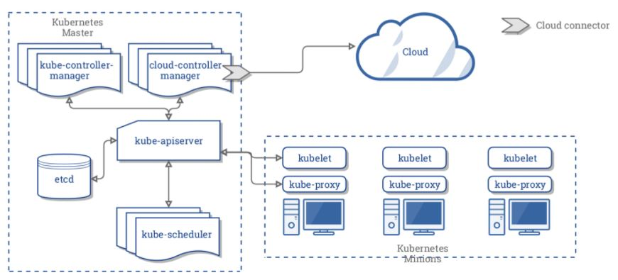

CKA 취득을 위해 이론적으로 공부한 내용들을 간단하게 기록하였습니다.
<!--more-->
## k8s Architecture



```
환경 : Amazon Linux 2 (t2 패밀리)
k8s version : v1.21
설치 방법 : Kubeadm | CNI : Calico

```

- Master node와 worker Node로 구성됨
  - master node 구성 : API server, Scheduler, Controller, etcd (클러스터의 상태, 컨테이너설정, 네트워킹 구성 등 관리)
    -각 control plane component들은 뒤에서 상세히 다룰 에정.
  - Worker node 구성 : kubelet, kube-proxy
- k8s 동작 방식
  - API server를 통해 API를 노출한다. Kubectl이라는 로컬 클라이언트를 사용하여 API와 통신한다.
  - Scheduler는 이러한 API들을 적절한 노드로 할당해주는 스케줄링 작업을 담당한다.
  - 각 worker node들에서 kubelet은 컨테이너 실행 요청을 수신하고 필요한 리소스들을 관리한다.
  - 각 worker node들에서 kube-proxy는 컨테이너의 네트워크를 담당한다. 

기본적으로 각 pod에서는 클러스터의 모든 노드에서 실행되는 다른 모든 pod에 대한 액세스가 제한되지 않지만 개발자가 pod 간 액세스를 제한할 수 있다.

또한 노드 풀이 업그레이드될 때, pod의 선언적 구성을 변경하거나 컨테이너의 이미지를 변경할 때 또는 노드가 사용 불가능하게 될 때 Control Plane에서는 스케쥴러에 의해 파드의 구성이 변경된다.

따라서 pod의 개념자체가 영구적인 지속이 아니기에 언제든지 pod는 재생성 될 수 있다. 그렇기에 Pod의 IP를 의존하면 안된다. 
k8s의 서비스를 사용해서 안정적인 엔드포인트를 통해 운영해야된다.

 ### Service
 서비스는 라벨을 사용하여 어떤 포드에서 작동할지 결정한다.
 포드에 라벨이 정확히 지정되어 있다면 서비스가 이를 자동으로 감지하고 노출시킨다.

서비스가 제공하는 포드 집합에 대한 액세스 수준은 서비스 유형에 따라 다르며 3가지 유형이 있다.
- ClusterIP(내부) : 기본 유형이며 이 서비스는 클러스터 안에서만 볼 수 있다.
- NodePort        : 클러스터의 각 노드에 외부에서 액세스 가능한 IP 주소를 제공한다.
- LoadBalancer    : 클라우드 제공업체로부터 부하 분산기를 추가하며 서비스에서 유입되는 트래픽을 내부에 있는 노드로 전달한다.

 ### k8s Component
1. Control Plane
  - worker node와 클러스터 내 파드를 관리
    - kube-scheduler : 정의된 replicaset의 요구조건 충족, 노드가 배정되지않은 파드의 배치 등등 worker node에 있는 Pod를 스케줄링하는 역할
    - kube-apiserver : Control Plane의 FE / API를 노출하는 역할 / k8s Cluster와 상호작용을 위한 api 서버
    - etcd           : 클러스터의 상태를 저장하여 일관성을 유지한다. (Data store) / Master Cluster에서 k8s object 저장소로 사용
    - kube-controller-manager :Deployments나 replcation Controller등 관리
      - node-controller
      - replication-controller
      - endpoint-controller
      - service-account&token-controller 
    - cloud-controller-manager :Public Cloud Provider 연동 관리
      - node-controller
      - route-contoller
      - service-contoller

2. Node Component
  - worker node 내 pod들을 유지
    - Kubelet    : k8s를 통해 생성된 Pod 내 컨테이너의 동작에 관여한다. 가령 정확한 스펙에 따라 동작하는지 등..
    - kube-proxy : 각 worker node에서 실행되는 proxy로 서비스의 개념을 구현한다. (Inbound,Outbound)
    - container runtime : docker, cri-o 등등..

3. CNI (Contanier Network Interface)
  - Pod가 생성되고 삭제될 때, 호출되는 API의 규격과 인터페이스를 정의해준다. (그니까.. Pod Network를 구축하는 플러그인들)
  - CNI마다 기본적으로 차지하는 리소스가 있기에 목적에 맞게..사용해야한다. **이미 훌륭하신분들이 테스트한 자료가 구글에...!!**
  - 결론적으로 성능이 잘 나와야하고, 부가기능(ACL)을 지원하는 등 목적에 맞게 선택해야 된다. ~~영원한 선택의 늪~~

### k8s Object
  - Pod : Worker Node 내 컨테이너들의 집합 (비영구적이다.)
    - 하나의 pod에는 한개 이상의 서비스로 지정될 수 있다.
    - 각각의 pod에는 veth가 할당됨 (파드내 컨테이너들은 veth, PID, 를 공유 [누가?! pause 컨테이너])
  - Service : Label로 묶어서 Endpoint를 노출시킴
  
  - configmap : pod에 담겨진 컨테이너에서 사용되는 구성 값
  - secret    : 특수 볼륨에 연결되어 컨테이너에서 사용가능 (mysql 패스워드 같은것들을 저장해두고 환경변수로 가져오는 방식으로 사용)

  - deployment Controller : pod 배포 및 관리에 사용하는 컨트롤러
                          : ReplicaSet을 자동으로 생성
                          : pod에 대한 Rolling 업데이트를 관리 (versioning)
    - ReplicaSet  : 사용자가 template에 명시해둔 Pod의 갯수를 유지한다. 
    - StatefulSet : Pod별 고정된 identity 할당 (name, network id 등)
    - DamonSet    : 모든 node에 배포되어 실행 (Node Selector로 정의하는 경우 일부 node에서 실행시키는 등 제어 가능, )
                  : 특정 노드 또는 모든 노드에 **항상** 실행되어 있어야 하는 특정 파드들을 관리한다. 가령 로그수집용도의 파드들..!
    - Jobs        : batch성 작업들, 특성 task 실행을 위해 하나 이상의 pod를 생성해서 task를 실행한 후 완료되면 Pod를 제거한다. (순차, 동시실행 지원, 다만 Lifecycle설정필요)

  - Volume            : Pod에 연결되어 디렉토리 형태로 데이터를 저장 (파드 간 컨테이너끼리 공유하며 Pod와 동일한 수명주기를 가짐)
  - PersistentVolume  : k8s에서 관리하는 저장소, Pod와 독립적은 수명주기를 가짐(사용자가 PVC를 정의하고 생성하면 대응하는 PV가 생기는 형식)

## 알아두면 좋을 3rt party tool
  - Helm : 사전 정의된 k8s 리소스에 대한 패키지
  - Kompose : docker compose를 K8s object로 변환
