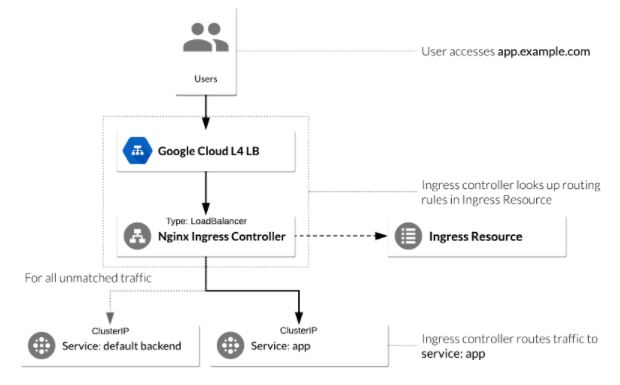
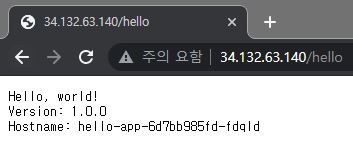
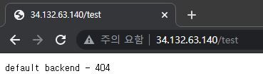

CKA 취득을 위해 이론적으로 공부한 내용들을 간단하게 기록하였습니다.
<!--more-->
### 배경
테스트를 몇번 진행하다가 Service의 LB와 Ingress의 차이가 이해되지 않아 몇자 적어봅니다.

### Service (LB) vs Ingress
우선 두가지 모두 내 파드 안에 띄워놓은 컨테이너들(애플리케이션)을 노출하고자할때 사용하는게 맞다.
앞서 설명하였듯이, Pod의 상태는 매우 유동적이기에 고정적인 IP나 Endpoint가 필요하기 때문에 사용하는 것 또한 맞다.

그럼 이 둘을 어떻게 구분지으면 될까?
각각 속성을 알아보자.

### Service와 Ingress 구분
Service와 Ingress 모두 부하분산처리를 한다는 점은 동일하다. 가장 큰 차이는 어떻게 서비스를 외부에 노출하느냐이다.

1. LB의 경우 : CSP(Cloud Service Provider)에서 제공하는 LB서비스가 필요하다 가령, AWS의 ELB, GCP의 GLB등 Cloud Load Balancer을 사용하거나 온프레미스 환경에서는 metalLB을 설치하여야 한다.
서비스 당 1개의 public IP를 부여받아야 하는 부분이다.

2. Ingress의 경우 : 서비스들의 상위 객체 개념으로 URL mapping하여 요청에 대한 경로를 지정해준다.

그러니까 비교 대상이 될 수 없다.
LB는 서비스지만 Ingress는 그런 서비스들에 대해 라우팅의 역할을 담당하기 때문에 상위 객체로 인식하면 될듯하다.

간단하게 Ingress L7, Service LB L4 정도로 ..!

### 테스트
```
kubectl create deployment hello-app --image=gcr.io/google-samples/hello-app:1.0
kubectl expose deployment hello-app  --port=8080.

kubectl get service
<--결과값-->
NAME         TYPE        CLUSTER-IP     EXTERNAL-IP   PORT(S)    AGE
hello-app    ClusterIP   10.43.254.28   <none>        8080/TCP   6s
```
hello-app 애플리케이션을 배포하고 expose하여 서비스로 노출시킨다.

#### NGINX 컨트롤러 사용


NGINX 컨트롤러는 외부에서 액세스할 수 있도록 노출되어야 한다.
NGINX 컨트롤러 서비스 중 서비스 type: LoadBalancer를 사용하면 컨트롤러를 노출시킬 수 있다.

```
helm install nginx-ingress stable/nginx-ingress --set rbac.create=true

kubectl get service
<--결과값-->
NAME                            TYPE           CLUSTER-IP      EXTERNAL-IP     PORT(S)                      AGE
hello-app                       ClusterIP      10.43.254.28    <none>          8080/TCP                     3m28s
kubernetes                      ClusterIP      10.43.240.1     <none>          443/TCP                      7m10s
nginx-ingress-controller        LoadBalancer   10.43.246.253   34.132.63.140   80:32210/TCP,443:30476/TCP   54s
nginx-ingress-default-backend   ClusterIP      10.43.248.107   <none>          80/TCP                       54s
```

- nginx-ingress-default-backend : 모든 URL 경로를 처리하고 NGINX 컨트롤러를 호스트하는 서비스이다.
서비스에 정상적으로 Nginx Ingress 가 배포된 것을 확인헀다면 테스트를 위한 경로 규칙을 정의해보자.
```
apiVersion: extensions/v1beta1
kind: Ingress
metadata:
  name: ingress-resource
  annotations:
    kubernetes.io/ingress.class: nginx
    nginx.ingress.kubernetes.io/ssl-redirect: "false"
spec:
  rules:
  - http:
      paths:
      - path: /hello
        backend:
          serviceName: hello-app
          servicePort: 8080
```
간단하게 34.132.63.140/hello에 대한 요청을 백엔드의 hello-app서비스의 8080으로 요청을 흘려주는 인그레스 리소스를 생성해보았다.
적용 해보자

```
kubectl apply -f ingress-resource.yaml
kubectl get ingress ingress-resource
```

이제 테스트 페이지를 확인해보자.

**정상경로 접근 시 결과**


**다른경로 접근 시 결과 (default backend 동작 확인)**

