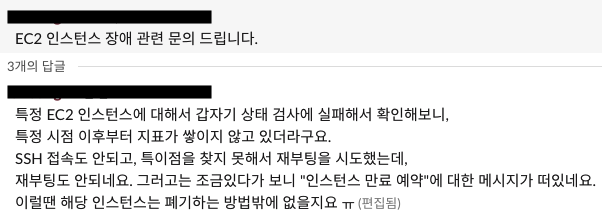
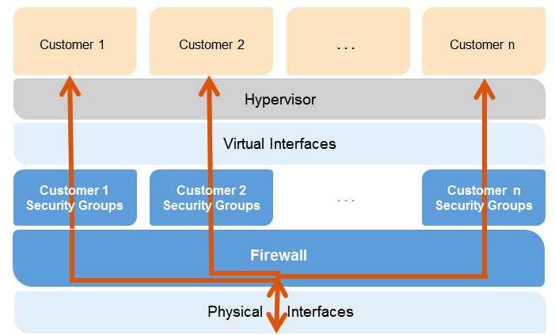
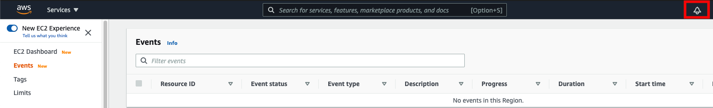
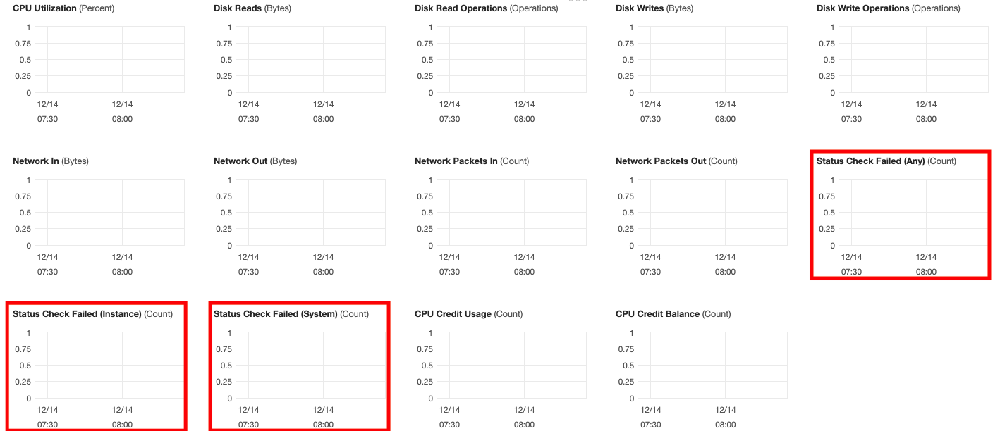
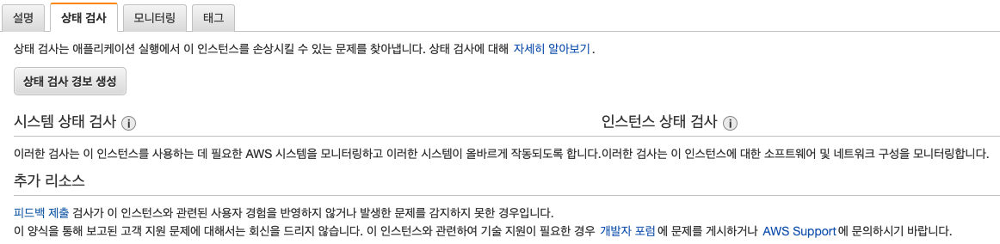
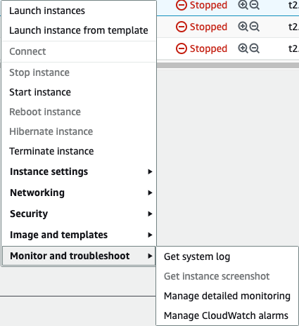
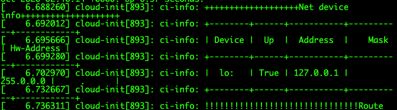

AWS EC2 Maintenance에 대해 적어뒀습니다.

<!--more-->

## 배경
GCP 혹은 AWS를 사용하면 심심치않게 일어나는 서비스이슈, 1년에 한 두번 일어날까말까하는 리전이슈가 있습니다.
서비스마다 대응방법이 다르지만, 우선 가장 비번하게 일어나는 Host hardware 이슈에 대해 기록합니다.

종종 Host Error! 혹은 Instance check Failed를 경험한 적이 있으실겁니다.

 - 출처 : AWSKRUG slack채널
### AWS System Check failed
 다들 아시다시피 ec2 인스턴스는 **AWS에서 Iaas 방식으로 제공하는 서비스**이기에 사용자가 해당 ec2 인스턴스를 프로비저닝하게 될 경우 선택한 리전과 가용영역의 데이터 센터 내 host computer에서 hypervisor 위에 고객의 요청에 의해 insatnce를 생성하여 제공하는 방식입니다.

 

여기서 만약 hypervisor와 instance간의 Network이 끊긴다면..? 아니면 Host 장비에 불이 난다면...?

**와장창-!** 말 그대로 인스턴스가 와장창 납니다.

 이러한 갑작스러운 이슈로 인해 발생하는 AWS 하드웨어의 Maintenance Event 혹은 System checkfailed 이슈로 인해 발생하는 예기치않은 이슈에 대해 정리하고 사례에 맞춰 사용자들은 어떻게 대처해야하는지에 경험을 공유하고자 합니다.

## AWS Maintenance

우선 AWS에서의 EC2 Event 종류와 Cloudwatch에서 확인할 수 있는 Status Check failed 지표는 아래와 같은 내용을 포함합니다.
  - AWS Event 
    - Instance stop : 예약된 시간에 인스턴스가 중지됩니다. 인스턴스를 다시 시작하면 **새 호스트로 마이그레이션됩니다.** 
    
    이러한 유형은 Amazon EBS가 지원하는 인스턴스에만 적용됩니다.
    
    - Instance retirement 
    - Instance reboot
    - System reboot 
    - System maintenance 

### Instance stop 

: 예약된 시간에 인스턴스가 중지됩니다. 인스턴스를 다시 시작하면 **새 호스트로 마이그레이션됩니다.** 

Instance stop이 일어나는 경우는 대게  Host hardware의 폐기 날이 결정된 것입니다.

이 경우, Maintenance 일정 이전에 스스로 stop/start를 진행하여 해소 할 수 있습니다.

두 눈을 크게 뜨고 정확히 봐야합니다.  Instance reboot이 아닌, Stop인 것을요.

Stop되어있는 인스턴스는 어떤 트리거가 발생하기 전까지는 결코 혼자서 벌떡 일어나진 않습니다.

    이러한 유형은 Amazon EBS가 지원하는 인스턴스에만 적용됩니다.

참고로 PHD(persnal Health Dashborad)에서 성능저하로 인해 예약된 이벤트들의 경우 되도록 빨리 인스턴스를 재부팅하여 새 호스트로 마이그레이션하는 것이 좋습니다. 

이미 성능이 저하된 호스트 하드웨어이기에 언제 어떤이슈가 발생할지 모르는 폭탄이기 때문입니다.

### Instance retirement 

: 예약된 시간에 인스턴스가 Amazon EBS에서 지원되는 경우 중지되거나 인스턴스 스토어에서 지원되는 경우 종료됩니다.

말 그대로 EBS 지원 인스턴스는 stop, 인스턴스스토어 지원 인스턴스는 terminate되는 이벤트입니다.

아직 발생해본적이 없어서 패스하겠습니다. (뭐..다를거 있겠냐만..)

### System Maintenance 

: 예약된 시간에 네트워크 또는 전력 유지 관리로 인스턴스가 일시적인 영향을 받을 수 있습니다

네트워크 유지 관리 시에는 예약된 인스턴스의 네트워크 연결이 잠시 동안 끊어집니다. 유지 관리가 완료되면 인스턴스의 네트워크 연결이 평소처럼 복구됩니다.

전력 유지 관리 시에는 예약된 인스턴스가 잠시 동안 오프라인 상태로 전환되었다가 재부팅됩니다. 재부팅 이후에도 인스턴스의 모든 구성 설정은 그대로 유지됩니다.

이제 가장 주로 겪은 두가지 이벤트를 다뤄보겠습니다.

하이라이트 입니다. 

## Instance reboot 
: 예약된 시간에 인스턴스가 재부팅됩니다.

말그대로 인스턴스의 재부팅을 의미하기에 os에서 reboot하는것과 동일하게 동작합니다.

메인터넌스 일정 이내에 사용자가 스스로 reboot을 먼저 실행하여 해소하는 방법과 메인터넌스 일정에 자연스럽게 해소하는 방법이 있습니다. EBS 볼륨의 데이터는 영향을 받지 않습니다.

유의사항으로는 인스턴스 재부팅 시 인스턴스스토어 볼륨 데이터와 public IP가 변경되기에 Elastic IP를 할당하여 고정 IP를 사용하고

만약 인스턴스스토어 볼륨을 사용한다면 미리 데이터를 백업해놓아야 합니다.

## System reboot 
: 예약된 시간에 인스턴스의 호스트가 재부팅됩니다.

인스턴스의 재부팅이 아닌, 인스턴스가 올라가있는 호스트 하드웨어의 재부팅입니다.

일반적인 사용자가 스스로 이벤트를 해소할 수 있는 방법이 없습니다.

AMI를 생성해서 다시 인스턴스를 구성할 경우 메인터넌스 이벤트를 회피할 수 있습니다. (Instance reboot과 동일하게 Elastic IP 유지필요, 인스턴스스토어 볼륨 데이터 증발)

필요에 의하지 않다면 AWS에 온전히 작업을 맡기는 것도 좋은 방법입니다. ~~(이 맛에 클라우드 쓰지)~~

다행히도 AWS가 시스템을 재부팅해도 DNS 이름이나 IP 주소와 같은 구성이 변경되지 않으며, 로컬 인스턴스 스토어에 저장된 데이터도 그대로 보존됩니다.

통상 이러한 재부팅들은 수 분 내에 끝난다고 말하지만 대부분의 경우 3분안에 이벤트가 종료되었던 것으로 경험했습니다.

모든 경우에서 서비스 서버(EC2)들은 AMI나 Snapshot을 통해 백업해두는 것이 가장 현명합니다.

이제 메인 빌런인 **갑작스러운 하드웨어 이슈에 의한 EC2 Reboot** 입니다.

보통 잘자다가 새벽에 천둥같은 알람이 울면 인스턴스의 모니터링 지표에 (System, Instance) Status check failed 알람이 발생하는 경우도 있습니다.

이게 무엇인고하니,  AWS는 두 가지 상태 확인을 통해 각 EC2 인스턴스 상태를 내부 모니터링 툴을 사용하여 모니터링합니다. 

- 요약
  - 시스템 상태 확인 실패(System status check failed)는 인스턴스가 실행되는 AWS 시스템에 문제가 있음을 나타냅니다.  (하드웨어 이슈)
  - 인스턴스 상태 확인 실패(Instance status check failed)는 대게 OOM(OutOfMemory) 등 리소스 이슈 혹은 잘못된 OS config 수정에 의해 발생합니다. (OS 이슈) ~~(간혹 커널이슈)

그렇기에 만약 인스턴스가 죽어서 Cloudwatch의 메트릭에서 위와같은 상태 검사 메트릭을 우선 확인한 뒤,

CPU, memory (Custom Metric으로 받아와야합니다.), Volume IO 등 리소스 사용량과 콘솔 상에서 확인할 수 있는 시스템 로그를 통해 dmsg 로그 확인 및 본인이 마지막으로 서버에 무슨 작업을 했는지 확인해야하고 (어쩔때는 갑자기 DHCP서버에서 EC2가 IP를 못받아서 죽었던 경험도 있습니다. Network Manager issue 였죠..)

3

시스템 상태검사 실패라면 재빠르게 stop/start 혹은 해당 이벤트를 트리거로 걸어두어 자동 reboot 작업을 걸어두는 것이 좋습니다.

[AWS 인스턴스 상태 모니터링 링크](https://docs.aws.amazon.com/ko_kr/AWSEC2/latest/WindowsGuide/monitoring-instances-status-check.html)

## 결론
세상에 100%의 가용성을 보장하는 서버는 없습니다. 그렇기에 SLA 기준이 존재합니다.

그러니 어쩔수 없는 상황에 대해서는 어느정도 인정이 필요합니다.

결국 어떻게 이슈를 대응하여 문제를 최소화하는것에 대해 고민이 필요한 것이지요.

서버 한 두대가 죽어도 서비스는 유지될 수 있도록 흔히 말하는 고가용성을 보장하는 아키텍쳐가 필요하다고들 합니다.

그건 어디까지나 AWS나 파트너사의 입장이고 실제 운영하는 입장에선 모든 상황에 고가용성 구성이 성능적이나, 비용적으로 효율적이지 못한 구조일 수 있습니다. 가령 zone간 혹은 리전 간 latency 등.. 실시간으로 트래픽을 처리해야되는 구조가 특히 힘들지요. 

제가 생각하는 논리는 이렇습니다.

1. 서버는 갑작스럽게 죽을 수 있다. -> 고가용성 구조가 필요하다 -> 비용적으로 이슈가 있다 -> 모니터링 시스템이 의존도가 높을 수 밖에 없다.
(가령 EC2 host issue alret 발생 시, EC2 auto reboot trigger 등)

2. AMI 백업을 주기적으로 실행한다.

이미 서버가 죽어서 서비스에 이슈가 발생했을 경우에 가장 필요한건 서비스의 빠른 Recovery이니까요.

관련해서 나중에 모니터링관련(Promethus, logstash,Fluentd) 내용도 정리하도록 하겠습니다.

감사합니다.
