GCP Network 서비스 중 CLB와 Instance_group에 대해 빠르게 훑어봤습니다.

<!--more-->

## 배경
Load Balancing (이하 LB)는 Client로부터 들어오는 트래픽을 여러 Backend Server (Instance, VM)에 분산하는 기능을 가지고 있습니다. 이를 통해 트래픽에 의해 Backend Server의 리소스가 과다하게 점유되어 서버가 터지는 것을 방지하고자 트래픽 즉 부하들을 분산시켜 서비스의 고가용성을 얻음과 동시에 성능적인 이점을 가져갈 수 있습니다.

LB를 사용한다고 항상 이로움만 얻을 수 있는 것은 아닙니다.

백엔드 서비스가 빵빵해도 LB 즉 프론트 단의 QPS의 한계로 인해 client의 request를 Drop시키는 경우도 있기 때문입니다.

LB에서 SSL offloading을 통한 백엔드 서비스의 부하를 줄일 수 있는거고 반대로 L4의 부하를 줄이기 위해 백엔드에서 SSL handshaking을 할 수 있는 것처럼 주어진 상황에 맞게 구성하는 것이 중요합니다.

AWS에서 Elastic Load Balancing로 서비스되는 것처럼 GCP의 로드밸런서는 CLB(CloudLoadBalancer)로 서비스합니다.

GCP에서 서비스하는 LB의 특징들을 요약해봤습니다. 

우선 CLB의 서비스적인 특징에 대해 확인해보겠습니다.

## CLB의 특징

- 프런트엔드 역할을 하는 단일 **anycast IP address**
- AWS의 ELB를 사용하던 유저들은 다소 생소할 수 있습니다. 왜냐면 AWS ELB는 FQDN을 통해 ELB를 제공하기 때문입니다. 

이는 AWS ELB의 Node라는 개념에 의해 어쩔 수 없이 Endpoint로 FQDN을 제공할 수 밖에 없는 AWS의 특징입니다. 
    그러나 GCP CLB는 트래픽을 IP를 통해 받을 수 있도록 프런트엔드에 external IP를 부여할 수 있습니다.

- **백엔드의 자동 지능형 자동 확장 **

  - LB는 SDN 형태로 Software 적으로 만들어진 것이며, 기존의 물리적인 장비가 갖고 있던 하드웨어적 처리 성능 한계를 갖지는 않습니다.
  -  SDN의 특성 상, 개념적인 하나의 LB가 하나의 Software Process를 의미하지 않으며, 필요에 따라 (백엔드 구성에 맞물려) 실제의 Data Plane을 담당하는 구성요소는 수평 확장되는 구조입니다.

  -  위의 특성들에 의해 전반적으로 성능의 한계는 Backend Services의 규모/구성에 의해 결정되는 요소가 오히려 더 크다고 볼 수 있습니다.

  -  병목현상이 일어난다면 AWS는 node에 대한 이슈까지도 염두해두지만 GCP에서는 QPS에 대한 측정 자료나 Backend latency, Total latency 등의 값을 참고하는 것이 이슈를 해소하기 좋습니다.


- 단일 리전에서 애플리케이션을 사용할 때의 리전 부하 분산 

- 전 세계에서 애플리케이션을 사용할 때의 전역 부하 분산 **(Premium 등급의 Network Tier가 필요)**

- CLB 백단에 있는 모든 백엔드가 auto scaling되진 않습니다.
인스턴스 그룹이 관리형(Managed)인지 비관리형(unManaged)인지에 따라 다르게 동작하며 이 부분은 인스터스 그룹에 대한 이해가 필요합니다.

- 캐시된 콘텐츠 전달을 위한 [Cloud CDN](https://cloud.google.com/cdn?hl=ko)과의 통합

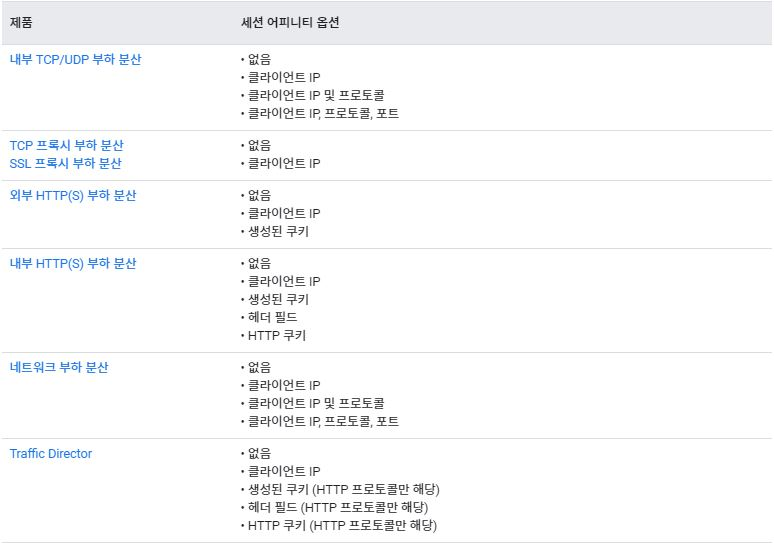


- 기본적으로 5-tuple hash 기반의 부하분산을 지원하지만, Statefull한 애플리케이션을 구성했을 경우를 대비하여 세션 어피니티를 지원합니다. 세션 어피니티는 백엔드가 정상이고 용량이 있는 한 동일한 클라이언트의 모든 요청을 동일한 백엔드로 전송합니다.

---

## Cloud Load Balancer 기초

크게 **백엔드 서비스**, **호스트 및 경로규칙(HTTP/s)**, **프런트 엔드**로 나뉘며 각기 항목별 세부적인 항목들이 있습니다.

### Backend
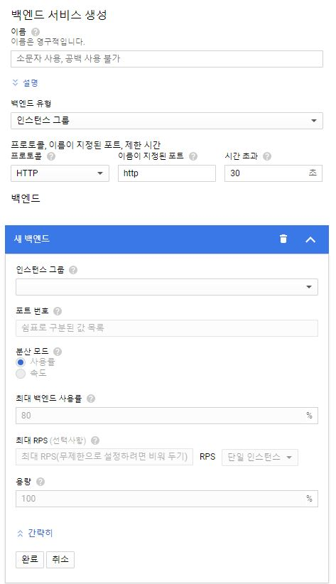


- 백엔드 유형 / backend port / 인스턴스 그룹 / 밸런싱 모드 / A capacity scaler / 타임아웃 / 세션어피니티 / 헬스체크 (포트 or 경로)


### 호스트 및 경로 규칙 (HTTP/s)
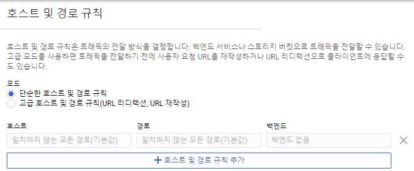


- 호스트 / 경로 / 백엔드


### FrontEnd
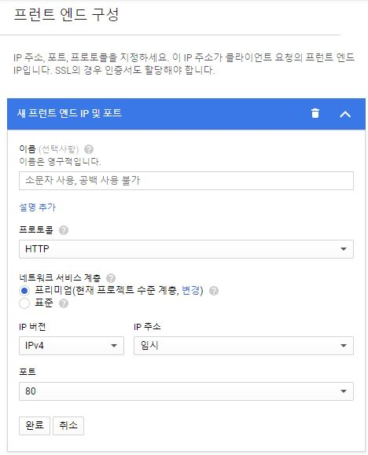


- 프로토콜 / 네트워크 계층 / external IP / Front Port
## CLB의 종류

```
- HTTP/HTTPS Load Balancing
- TCP/UDP Load Balancing
- TCP/SSL Proxy Load balancing
```

CLB는 어느 프로토콜을 지원하는지에 따라 3가지의 종류로 나뉘어집니다.

HTTP(S), TCP, TCP proxy LB의 차이를 확인해야 헷갈리지 않습니다.

### HTTP/HTTPS Load Balancing
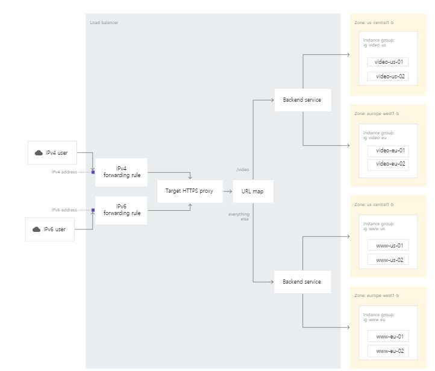

- 7계층에서 동작합니다.
- 여러가지 백엔드 유형을 지원하며,  **대상 HTTP(S) 프록시**는 클라이언트로부터 요청을 받습니다.
- HTTP(S) 프록시는 트래픽 라우팅을 결정하기 위해 URL 맵을 사용하여 요청을 판단(컨텐츠 기반 부하분산)합니다. 
- 프록시는 SSL 인증서를 사용하여 통신을 인증할 수도 있습니다.
- 세션 유지 시간은 600초로 고정되어있습니다. 

(websocket에는 적용되지않지만, 일반적으로 백엔드가 조기에 세션을 끊는 일이 발생하지 않도록 600초보다 길게 KeepAliveTime Out값을 설정하는 것이 좋습니다.)

- websocket을 지원합니다.
- gPRC를 지원합니다. (AWS ALB에도 2020년 11월 추가됐습니다.)
- QUIC를 지원합니다 . (Quick UDP Internet Connections / HTTP3 )


### TCP/UDP proxy Load Balancing
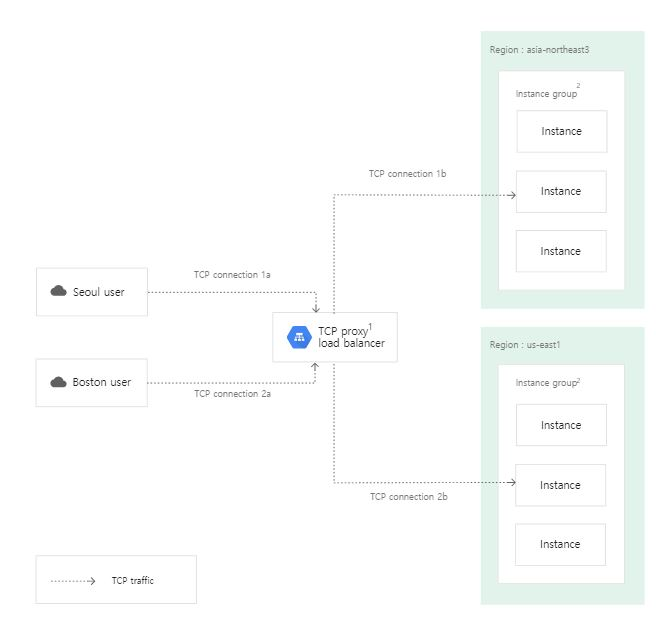

- 4 계층에서 동작합니다.
- TCP 연결을 통해 들어오는 트래픽이 부하 분산 레이어에서 종료된 후 TCP 또는 SSL을 통해 사용 가능한 가장 가까운 백엔드로 전달됩니다.
- 자동으로 트래픽을 사용자와 가장 가까운 백엔드로 라우팅합니다.
- TCP 80 or 8080 Port를 지원하지 않습니다. (HTTP/s LB로 쓰면됩니다.)
- TCP 프록시 부하 분산기는 역방향 프록시 부하 분산기입니다. 부하 분산기는 수신 연결을 종료한 후 부하 분산기에서 백엔드로 새 연결을 엽니다. 역방향 프록시 기능은 Google 프런트엔드(GFE)에서 제공합니다.
- 가장 많이 사용되는 TCP 포트 지원: 25, 43, 110, 143, 195, 443, 465, 587, 700, 993, 995, 1883, 3389, 5222, 5432, 5671, 5672, 5900, 5901, 6379, 8085, 8099, 9092, 9200, 9300.


### TCP/UDP Load Balancing
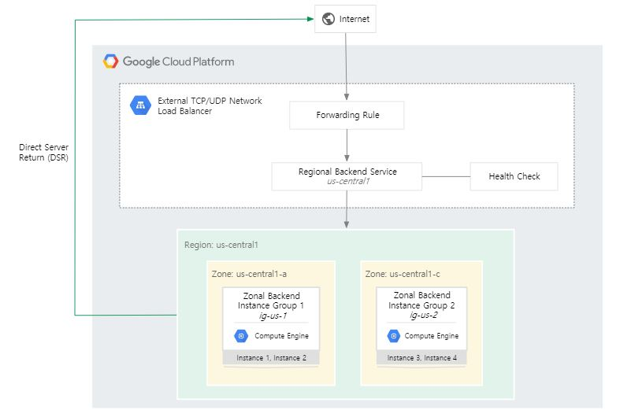

- 4 계층에서 동작합니다.
- pass-through LB 입니다. (글로벌 서비스를 위해 백엔드에서 모든 Ingress IP/port에 대한 허용이 필요합니다. )
- 수신(ingress)/요청(request) 패킷만 lb를 통과  - 송신(engress)/응답(response) 패킷은 lb를 거치지 않고 바로 client로 가는 DSR로 동작합니다.
  - 부하 분산된 패킷은 소스 IP가 변경되지 않은 백엔드 VM에서 수신됩니다.
  - 부하 분산된 연결은 백엔드 VM에 의해 종료됩니다.
  - 백엔드 VM의 응답은 부하 분산기를 통하지 않고 클라이언트에 직접 전달됩니다. (위에서 설명한 DSR이 이것입니다.)
- 연결 추적 테이블과 구성 가능한 일관된 해싱 알고리즘을 사용하여 트래픽이 백엔드 VM에 분산되는 방식을 결정합니다.
- Proxy가 아닙니다. 그렇기에 모든 트래픽은 proxy가 아닌 LB를 통해 전달되며 동일한 지역의 VM 인스턴스 간에만 트래픽을 분산합니다.
- 앞서 HTTP/s, TCP/UDP proxy LB들과 같은 Regional LB와는 달리 전달 규칙을 사용하여 수신 IP 프로토콜 데이터를 기반으로 시스템의 부하를 분산합니다.
- 백엔드 VM이 비정상 상태여도 TCP 패킷에 응답하면 세션을 다른 백엔드 VM으로 넘기지 않습니다. 

이 LB를 선택하는 이유는 TCP/UDP proxy LB에서 지원하지 않는 포트에서 부하분산을 구성할 때 사용합니다.

### SSL offloading

당연하게도..SSL Offloading을 지원합니다. 

AWS에서는 ACM 에서 발급이 가능했다면 GCP 또한 google Managed SSL 인증서를 지원합니다.

Google 관리형 SSL 인증서는 도메인에서 Google Cloud가 가져오고 관리하는 도메인 유효성 검사(DV) 인증서입니다. 각 인증서에서 여러 호스트 이름을 지원하며 Google은 인증서를 자동으로 갱신합니다.

이를 통해 External HTTPs LB, SSL proxy LB를 구성할 수 있습니다.

## 사용하면서 배운 것들

### 1. LB를 사용할 때 백엔드 서비스 구성

우선 LB의 백엔드 구성 간 선택지는 기본적으로 백엔드 서비스, 버킷, TCP에는 인스턴스 Pool을 직접 연결하기도 하지만
저의 경우 GCP 내의 VM으로 트래픽을 전달받아야하기 때문에 백엔드 서비스의 인스턴스 그룹 혹은 인스턴스 Pool로 셋팅합니다.

이때 그룹의 종류가 두가지로 나뉘는데 앞서 1편에서 말했던 인스턴스 그룹의 두 종류인 비관리형(Unmanaged Instance Group)과 관리형(Managed Instance Group)  그룹입니다.

1-1 **MIG**는 단일 region 내 멀티 zone에 VM 인스턴스를 분산함으로써 single zone failure 에 대응하여 워크로드의 고가용성을 높일 수 있습니다.

예를 들어, zonal failure 가 발생하거나 특정 zone 내에 위치한 인스턴스들에 장애 발생시, regional MIG 에 포함된 다른 zone에서 실행되는 인스턴스가 트래픽을 처리함으로써 고가용성을 구성할 수 있습니다. 


**[MIG 의 특징]**

- 애플리케이션 로드를 멀티 zone 으로 분산

- 최대 2,000개의 인스턴스까지 관리 가능 (zonal MIG의 2배)

- 멀티 zone 을 사용함으로써 zonal failure 및 단일 zone 내 인스턴스 그룹의 오작동과 같은 시나리오로부터 보호

- zonal failure 발생 혹은 zone 내 인스턴스 장애시, regional MIG에 포함된 다른 zone 에서 트래픽을 처리


1-2 **UIG**는 단순히 같은 zone내의 인스턴스들을 집합화 시킨 server pool이라고 이해하면 됩니다.

인스턴스 템플릿이 필요하지 않습니다. 단지 같은 zone내의 인스턴스라면 그룹화시켜 LB를 통해 트래픽을 받을 수 있습니다.

UIG를 사용할지 MIG를 사용할지는 어떤 서비스를 제공하는지에 따라 다릅니다.
[저희팀에서는 UIG로 인프라를 구성하고 관리합니다.]

MIG는 동일한 구성의 인스턴스를 여러 개 만들기 위한 것입니다. 기존 인스턴스 템플릿을 업데이트하거나 생성된 인스턴스 템플릿을 변경할 수 없습니다. 구성을 변경해야 하는 경우 새 인스턴스 템플릿을 만들고 새로운 UIG를 생성해야합니다. (혹은 롤링업데이트..)
매번의 변경사항이 있을때마다, 이미지를 새로 생성하고 템플릿으로 만들어서 배포에 추가하기엔 대응이 너무 늦습니다. 또한 스펙까지 고정되어야 합니다..

그러나 UIG는 전혀다른 스펙과 구성의 인스턴스들을 그룹핑 시킬 수 있습니다.

따라서 서비스의 특성 상 순간적인 트래픽이 발생하기보단 꾸준한 유저들의 동접 수를 대응하기에 예상 트래픽의 최대치를 기준으로 서버를 생성하고 일정기간 모니터링하여 optimizing하는 방법으로 GCP를 활용하고 있습니다. 


### 2. Global HealthCheck

AWS를 사용할때는 ALB의 sg를 참조하여 백엔드 EC2의 보안그룹을 유연하게 구성했다면, 다행히 GCP LB에서는 LB에 node 개념이 없습니다.

다만, Global HC라고하는  백엔드에 연결하는 전역 및 리전별 상태 확인 시스템을 제공합니다.

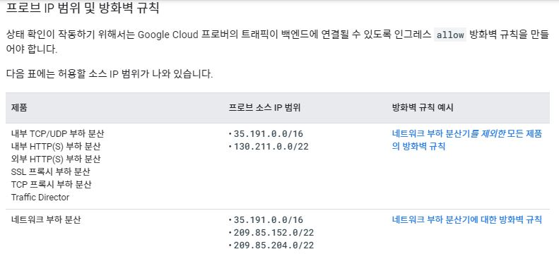

- Global Healthcheck가 존재합니다. (백엔드 서비스의 방화벽에서 필수적으로 Ingress를 허용해줘야 합니다. )

각 연결 시도를 *프로브*라고 부르고, 각 상태 확인 시스템을 *프로버*라고 부릅니다. 

### 3. 인스턴스와 인스턴스 그룹 재사용

하나의 인스턴스는 동시에 여러 인스턴스 그룹에 그룹핑될수 없습니다.

만약 한대의 인스턴스 내에 여러 서비스가 올라가있는 상태라면 Instance Group으로 나눌수는 없으니 백엔드 포트를 서비스 마다 열어두고, 
 
한대의 인스턴스 그룹을 여러 LB로 연결하는 방식으로 재사용 해야합니다.

### 4. 결론

결론적으로 CLB는 유저의 Ingress/Request에 대한 트래픽을 어떤 프로토콜을 통해 받아서 어떤 방식으로 백엔드에 전달하는가에 따라 종류가 나뉘어지며

크게는 OSI 7 Layer에 의해 (HTTP, TCP/UDP)로 나뉘며, Traffic Flow 자체는 Front 단에서의 전송방식 및 Egress/Response를 기준으로 구별합니다. (Proxy의 유무)

HTTP/s or TCP (Proxy) LB의 경우

- IPv4, IPv6 프로토콜을 모두 지원하며, 전달 규칙(Forwarding rule)을 HTTPS proxy에서 URL map을 통해 각 백엔드 서비스로 프록시 처리됩니다. 
- 네트워크 등급에 따라 Global, Regional LB의 지원 여부가 달라집니다.
- 기본적으로 균등하게 부하를 분산하지만, 아주 작은 수의 요청은 균등하게 분배되지 않을 수 있습니다
- Session affinity를 통해 해시를 기반으로 특정 클라이언트의 요청을 동일 백앤드 VM으로 전달하도록 설정 할 수 있습니다. 
- SSL offloading을 지원합니다. 

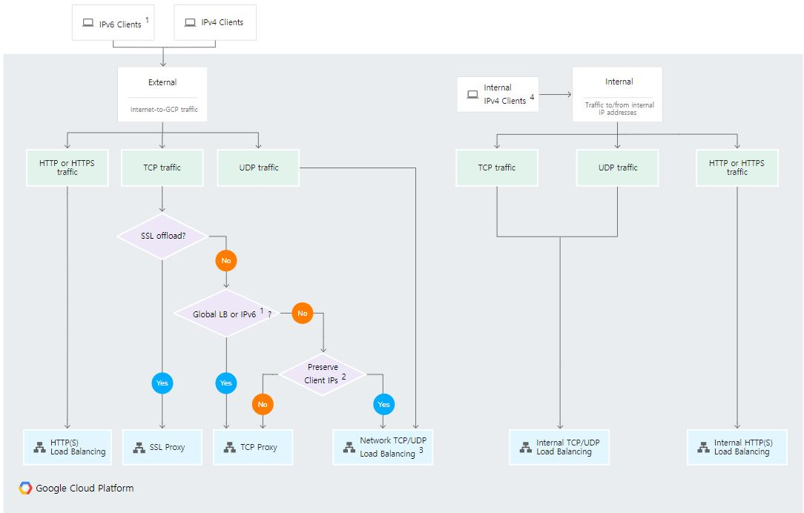

 GCP에서 제공하는 LB 선택 로드맵입니다.


## Loadbalancing Test
부하분산이 정상적으로 이뤄지고 있는지 확인해봅시다.

```
목차
[1. HTTP/s LB 테스트]
[2. TCP LB 테스트]
[3.TCP porxy LB 테스트]
```
---

### 인스턴스 그룹 생성
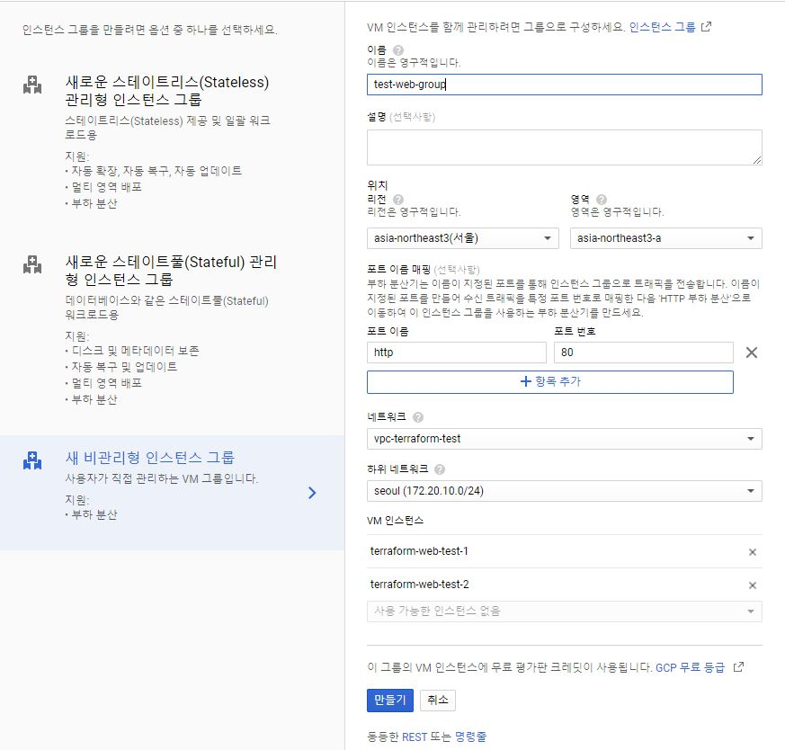

기본적으로 백엔드 서비스는 UIG로 생성할 예정이며 단일 존 내부에 두대의 Web service를 띄워 확인해보겠습니다.

### 상태 검사 생성
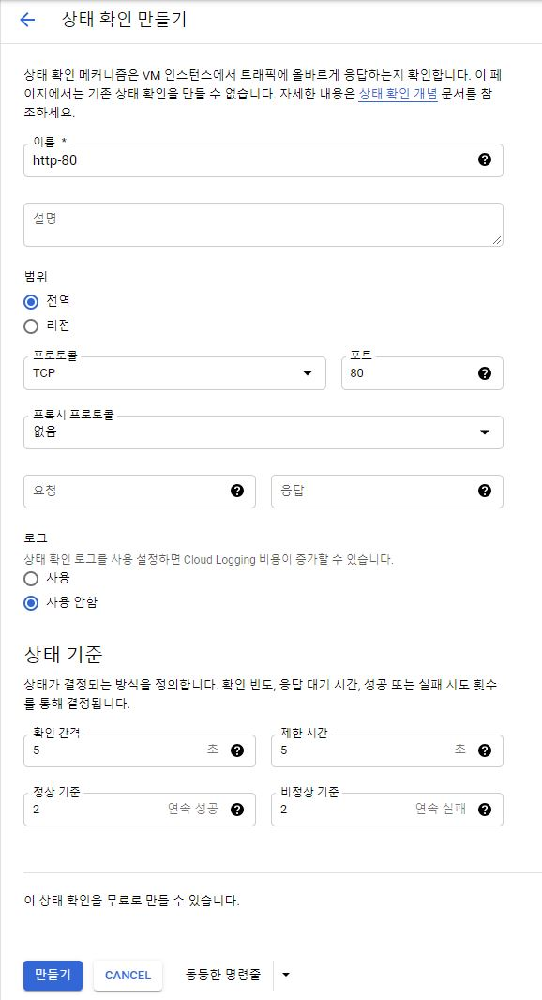

우선 Http-80으로 상태 검사를 진행할 예정입니다. 고고

## HTTP/s LB-Test

### LB 생성
### HTTP Backend 생성
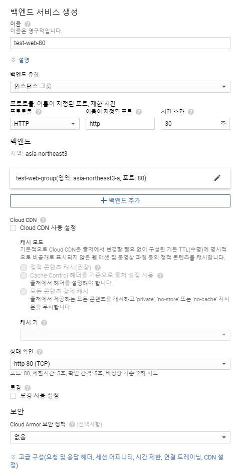

### HTTP 검토 및 확인
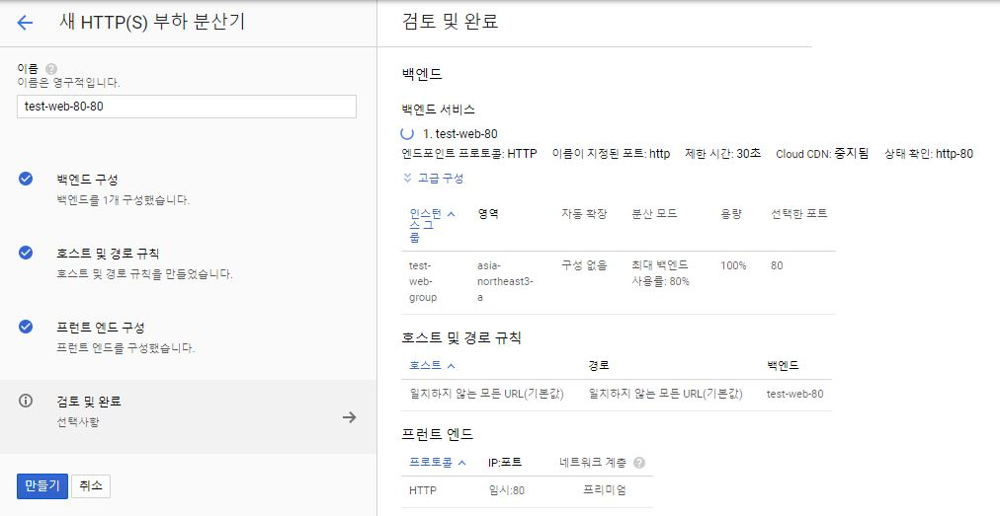

나머지 LB들도 동일하게 구성하면 되기에 configuration에 대한 내용은 여기까지...! Test 를 하러갑시다.

 (TCP LB는 그룹이 아닌 인스턴스 Pool로 등록 / TCP LB생성 간 단일리전으로 선택하면 TCP proxy가 아닌 TCP LB로 구성을 도와줍니다.)

#### Test 1. Health check 확인 
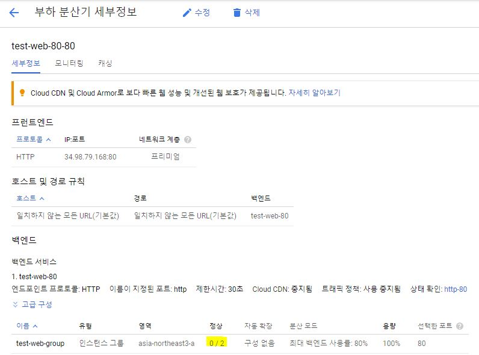

LB를 생성하고 나면 정상상태의 인스턴스가 확인되지 않는다. 당연히 80포트의 데몬이 떠있질 않으니, 헬스체크가 안되는겁니다.

우선 인스턴스 방화벽에서 35.191.0.0/16,130.211.0.0/22 80 Ingress를 허용해준 뒤, 얼른 서버로 접근하여 httpd를 띄워봅시다~

---

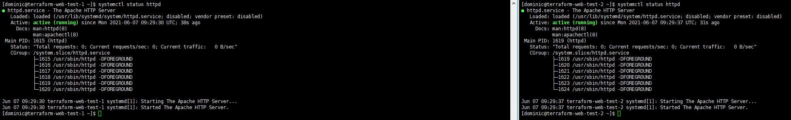

http 데몬을 올린 뒤, 설정해둔 상태검사 포인트만큼 수십초를 기다리면 금방 헬스체크가 되는 모습을 볼 수 있습니다. 
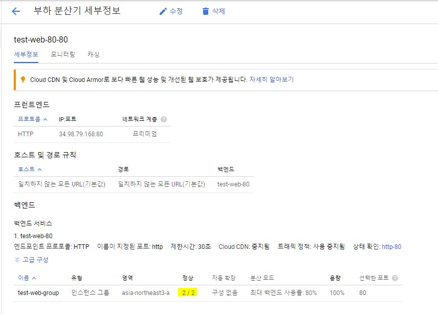
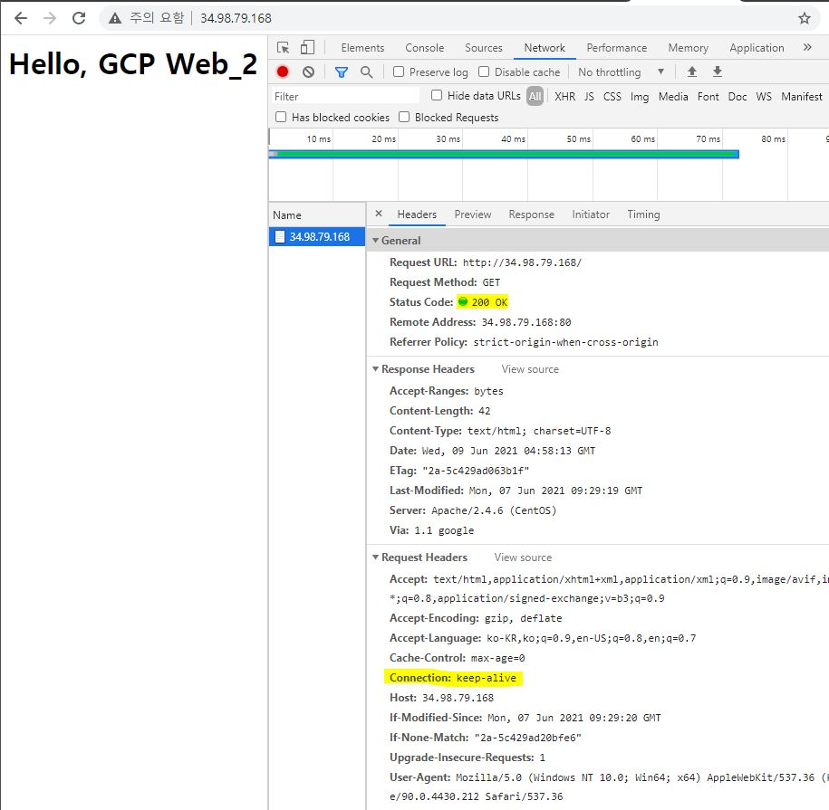    

F5를 다다다닷 누르기는 싫어서 curl을 실행하는 간단한 스크립트를 통해 확인해본 결과,
```
#!/bin/bash

number=0
while [ $number -le 50 ]
do
curl 34.98.79.168 >> $(date +"%y%m%d").txt
sleep 3
  ((number++))
done

```

Web 1번 22회, Web 2 29회가 확인됩니다. 왜 정확히 반반 나뉘지 않는걸까요?

**-# GCP의 설명 #-**

**"- 기본적으로 균등하게 부하를 분산하지만, 아주 작은 수의 요청은 균등하게 분배되지 않을 수 있습니다"**

...흠..🤣🤣🤣🤣🤣🤣 
#### Access log 확인

그럼 실제 서버에서는 어떻게 요청이 오는지 Access.log를 통해 확인해보겠습니다.


HC 대역인 35.191.0.0/16으로 Healthcheck와 Client의 요청과 결과가 잘 찍혀있네요.

왜 HC 대역이 access log에 남는걸까요?

실제 부하 분산 트래픽의 소스 IP 주소는 상태 확인 프로브 IP 범위와 같기 때문입니다.

부하 분산기는 수신 연결을 종료한 후 부하 분산기에서 백엔드로 새 연결을 엽니다. 

이후 target proxy에서 URL map을 통해 백엔드 서비스쪽으로  reverse proxy하기에 백엔드 서비스는 실제 Source IP를 알 수 없는겁니다.

Source IP가 필요하다면 X-forward-for Header를 통해 확인 할 수 있습니다.

#### HTTP backend session affinity


생성해놨던 HTTP LB의 백엔드 구성에서 cookie를 생성해줍니다.
생성된 쿠키 어피니티가 설정되면 LB가 첫 번째 요청에서 쿠키를 생성합니다. 

LB는 동일한 쿠키를 사용하는 각 후속 요청에서 같은 백엔드 VM 또는 엔드포인트로 요청을 전달합니다.

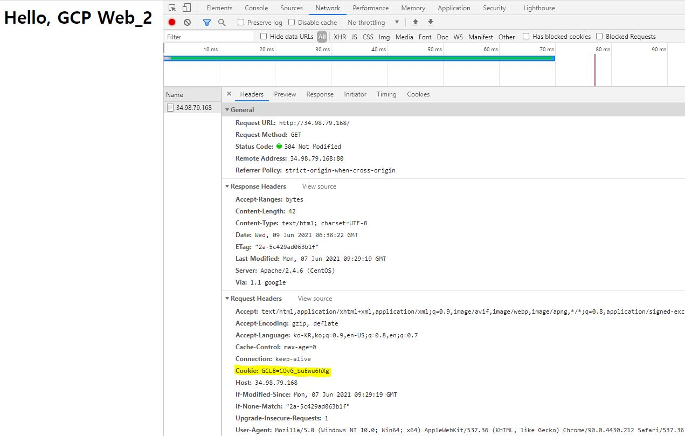

GCLB라는 cookie가 확인됩니다. 쿠키 값을 통해 고정 세션을 유지할 수 있습니다. 영원히 세션이 고정되는것은 아닙니다.

Timeout으로 설정해둔 (HTTP는 Keep AliveTimeout값이 제한 시간 값을 따라갑니다.) 30초 후엔 새로운 세션이 연결됩니다.

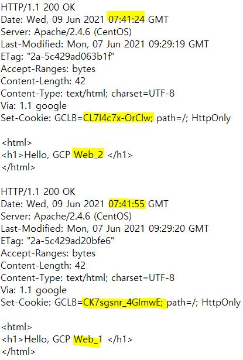

위 결과, (31초 후 curl -i 동작) 31초마다 세션이 바뀌는걸 확인할 수 있습니다.

