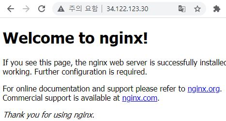

GKE를 생성해서 kubectl에 익숙해져보자.
<!--more-->
### GKE(google Kubernetes Engine)

기존 쿠버네티스와 동일하게 Master(Control Plane)과 Worker Node로 구성되어있으며, GCP 관리형 서비스이기에 노드 확장 등의 편리함이 있다. (arg. AWS EKS...)
그저, 위치와 k8s 버전, Network (VPC) 환경과 IP 대역만 설정하면 내부에 알아서 k8s cluster를 생성해준다.

### GKE Cluster 생성
지난 번과 동일하게 GKE Cluster를 gcloud 명령어를 통해 생성해준다. 

```
gcloud container clusters create dominic-gke-1

<---결과값--->
kubeconfig entry generated for dominic-gke-1.
NAME           LOCATION       MASTER_VERSION    MASTER_IP     MACHINE_TYPE  NODE_VERSION      NUM_NODES  STATUS
dominic-gke-1  us-central1-b  1.19.10-gke.1600  34.71.29.146  e2-medium     1.19.10-gke.1600  3          RUNNING
```
### 웹 배포
지난번과 같이 인증 이후 nginx를 배포한다.

```
kubectl create deployment nginx --image=nginx:1.10.0
<---결과값--->
deployment.apps/nginx created
```

배포가 완료되었다면, 정상적으로 파드에 nginx 컨테이너가 잘 계신지 확인해보자.

```
kubectl get pods
<---결과값--->
NAME                    READY   STATUS    RESTARTS   AGE
nginx-56cd7f6b6-2nc6l   1/1     Running   0          59s
```

마찬가지로 expose 명령어를 통해 서비스를 생성하여 외부로 컨테이너를 노출 시켜보자.

```
kubectl expose deployment nginx --port 80 --type LoadBalancer
<---결과값--->
service/nginx exposed
```
Kubernetes가 백그라운드에서 공개 IP 주소를 사용하는 LB를 통해 nginx pod로 요청이 라우팅 될 것이다.
방금 만든 서비스를 확인해보자..

```
kubectl get services
<---결과값--->
NAME         TYPE           CLUSTER-IP    EXTERNAL-IP     PORT(S)        AGE
kubernetes   ClusterIP      10.3.240.1    <none>          443/TCP        14m
nginx        LoadBalancer   10.3.255.47   34.122.123.30   80:31317/TCP   77s
```

**결과**



### pod 상세 조회해보기
kubectl describe pods 명령어를 통해 해당 파드의 ip주소 및 이벤트 로그등 여러 정보를 확인할 수 있다. 파트에 뭔가 문제가 생겼다면 가장 먼저 확인해보게 될 명령어이다.

kubectl logs 명령어를 통해서는 로그를 확인할 수 있다. -f 옵션을 주어 실시간으로 로그스트림을 확인하는 것도 가능하다.
가령 다른 터미널을 하나 열어 -f로 로그를 모니터링하고 요청이 정상적으로 들어오는지 체크해볼 수 있다.

### 포드와 상호작용하기
포드 내 컨테이너에서 셀을 사용할 수 있다면, kubectl exec 명령어를 사용하여 셸 접근을 할 수 있다.
로그나 파드에서 컨테이너의 상태가 좋지 않을 때, 컨테이너 내 작업이 필요할 경우 유용하다.

### 서비스
서비스의 라벨 셀랙터를 사용하여 제한된 포드 집합을 외부에 노출해보자.

#### 서비스 만들기
```
kind: Service
apiVersion: v1
metadata:
  name: "nginx"
spec:
  selector:
    app: "nginx"
    name: "dominic"
  ports:
    - protocol: "TCP"
      port: 443
      targetPort: 443
      nodePort: 31000
  type: NodePort
```
NodePort 타입으로 외부트래픽을 31000에서 컨테이너의 443으로 전달하도록 service.yaml을 작성하였다.
Nodeport를 사용할때는 포트가 겹치지 않도록 구성해야 충돌이 발생하지 않는다.
별도의 LB를 달지 않았기에 노도의 외부 IP와 31000 포트를 사용하여 파드 내 컨테이너에 접근해보자.

```
curl -k https://<EXTERNAL_IP>:31000
```

되시는 분은 오점을 찾으신거고, 안되셔서 당황하셨으면 아직 service에 대해 공부가 조금 더 필요한거다.
안되는 이유를 아시면 넘어가시고 아니라면 아래 명령어를 통해 생성한 서비스의 구성을 확인해보자.

kubectl describe services nginx

답은 service의 selector에 있다. 현재 우리의 nginx 파드는 엔드포인트가 없다 왜냐 라벨이 지정되어있지 않기에 서비스의 셀렉터에 감지되지 않았기 때문이다.
라벨을 추가해주자.

```
kubectl label pods nginx-56cd7f6b6-2nc6l 'app:nginx'
kubectl label pods nginx-56cd7f6b6-2nc6l 'name:dominic'
```

이제 파드에 정확히 라벨을 지정하였으니, 엔드포인트가 확인 될 것이다. 


**결과**


### 결론
쿠버네티스에서 서비스는 파드의 논리적 집합과 그것들에 접근할 수 있는 정책을 정의하는 추상적 개념이다. (때로는 이 패턴을 마이크로-서비스라고 한다.) 서비스가 대상으로 하는 파드 집합은 일반적으로 셀렉터가 결정한다. 물론 셀렉터가 없는 서비스도 가능하다. 

가령 
프로덕션 환경에서는 외부 데이터베이스 클러스터를 사용하려고 하지만, 테스트 환경에서는 자체 데이터베이스를 사용한다.

또는 한 서비스에서 다른 네임스페이스 또는 다른 클러스터의 서비스를 지정하려고 한다.

혹은 워크로드를 쿠버네티스로 마이그레이션하고 있다. 해당 방식을 평가하는 동안, 쿠버네티스에서는 백엔드의 일부만 실행한다.
간혹 몇몇의 케이스에 따라 별도의 파드 셀렉터 없이 서비스를 정의하는 것이 가능하다.

## 사례 1.
```
apiVersion: v1
kind: Service
metadata:
  name: my-service
spec:
  ports:
    - protocol: TCP
      port: 80
      targetPort: 9376
```

이 서비스에는 셀렉터가 없으므로, 해당 엔드포인트 오브젝트가 자동으로 생성되지 않는다. 엔드포인트 오브젝트를 수동으로 추가하여, 서비스를 실행 중인 네트워크 주소 및 포트에 서비스를 수동으로 매핑할 수 있다.

## 사례 2.
```
apiVersion: v1
kind: Endpoints
metadata:
  name: my-service
subsets:
  - addresses:
      - ip: 192.0.2.42
    ports:
      - port: 9376
```
셀렉터가 없는 서비스에 접근하면 셀렉터가 있는 것처럼 동일하게 작동한다. 위의 예에서, 트래픽은 YAML에 정의된 단일 엔드 포인트로 라우팅된다. 192.0.2.42:9376 (TCP)

ExternalName 서비스는 셀렉터가 없고 DNS명을 대신 사용하는 특수한 상황의 서비스이다.