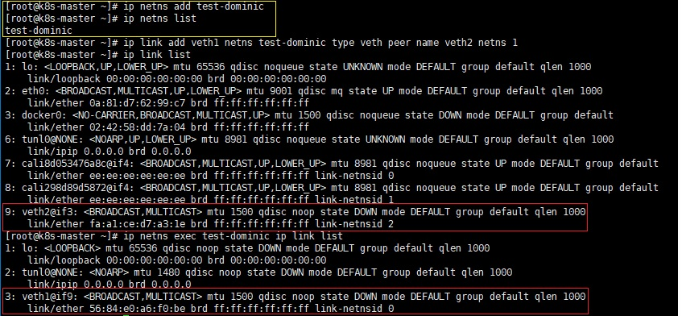
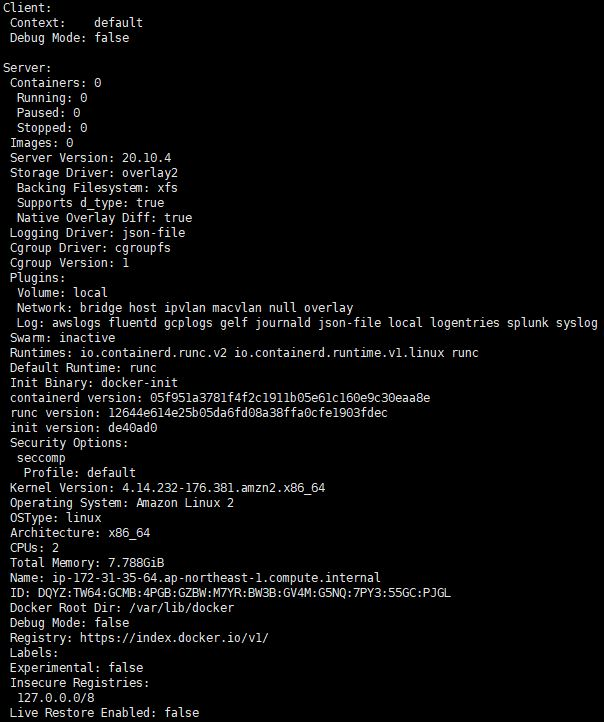
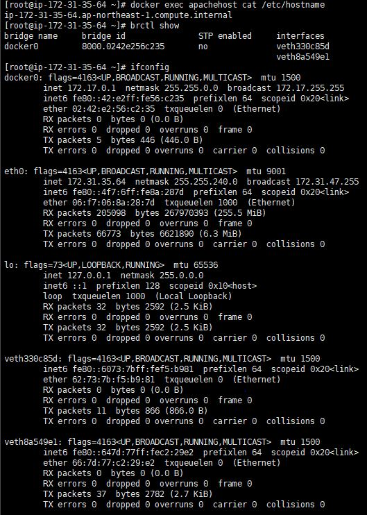

컨테이너 Network부터 Pod Network까지 기록해봤습니다.
<!--more-->

### Docker Networking
- 격리된 환경에서 실행되는 하나의 **프로세스**
- 위에서 격리된 환경을 구현하는 기술은 chroot, cgroups, namespace
  - namespace : 네트워크인터페이스, 라우팅, 방화벽 규칙들을 격리한다. 이런 namespace로 인해 격리된 PID들은 veth를 통해 연결한다.
  - veth : linked virtual ethernet device pair = 항상 쌍 (pair)로 생성되어 연결된 상태를 유지한다.

직접 Namespace를 생성해보자.



local namespace와 ipnetns add를 통해 만든 namespace에 veth를 붙여봤다.

컨테이너를 새로이 배포할때마다 컨테이너에게 veth0라는 가상 네트워크 인터페이스를 할당하여 docker0에 연결,
linked virtual ethernet device pair로 컨테이너와 bridge를 연결한다.


- 도커 설치 직후 상태 
#### bridge Network

결국 컨테이너 네트워크 인터페이스 (Namesapce 내 veth)들은 bridge(docker0 : docker 시작시 기본적으로 생성되는 bridge)를 통해 연결되어 하나의 세그먼트로 구성되지만, 같은 bridge에 연결되지 않은 컨테이너들은 격리된 공간을 유지한다.

**[eth0 -> docker0(bridge) -> veth0(host) <-[pairing]-> veth0(container) -> container]**


위 이미지에서 bridge의 subnet과 Gateway를 보고 밑에 container의 IP를 보면 확실하다.

아니면 brctl show 명령어를 통해 bridge에 연결되어있는 Interface에 veth를 확인하면 된다.

default bridge 말고, custom bridge를 생성하여 별도의 네트워크 구성도 물론 가능하다고 하지만, 해보진 않았으므로 잠시 미뤄두겠다.

#### Host Networking



Host에서 사용하고 있는 네트워크를 그대로 컨테이너가 사용한다. 

그렇기 떄문에 컨테이너에 IP(veth)를 할당하지 않기에 bridge에 바인딩이 되지 않는다.

#### overlay Networking

다른 도커 데몬 host의 container와 통신하기 위해 보통 OS레벨에서의 라우팅이 필요하지만, Overlay 네트워크를 사용하여 분산 네트워크(arg. Swarm service)를 구성할 수 있다.

#### none Networking
none : 모든 네트워킹 드라이버, 그 어떠한 인터페이스도 없는 설정이다. 보통 커스텀 네트워크 드라이버를 구성할 경우 사용한다.

#### macvlan, ipvlan Networking
말그대로 가상 mac주소를 할당하여 물리적 호스트처럼 보이도록 설정하거나, L2,L3 모드가 필요할 때 사용한다.

### k8s Networking


#### Pod Networking 
Container Network에서 설명했듯이, 각각의 컨테이너는 독립적인 namesapce를 통해 격리되어진다.

여기서 k8s의 Pods의 개념이 들어가면 같은 pod의 컨테이너들은 Network namespace를 공유한다.(컨테이너가 N개여도 veth는 1개) 그렇기에 동일한 IP를 사용한다.

따라서 lookback 인터페이스를 통해 localhost+port 통신이 가능하다.

이 Pod 내 컨테이너들의 Namespace를 공유해주는게 바로 pause 컨테이너이다.


## Docker Test
GCP 환경에서 docker를 사용하여 이미지를 빌드하고 실행해봅시다.

Docker 컨테이너 빌드, 실행과 Docker Hub 및 Google Container Registry에서 Docker 이미지 가져오기

그리고 Dockerfile을 통해 이미지를 생성하는 법에 대해 간단하게 확인해봤습니다.

###  Hello World

GCP에서 제공하는 Cloud shell을 열어 Hello world 컨테이너를 실행합니다.

```
docker run hello-world

<--명령어 결과-->
Unable to find image 'hello-world:latest' locally
latest: Pulling from library/hello-world
b8dfde127a29: Pull complete
Digest: sha256:9f6ad537c5132bcce57f7a0a20e317228d382c3cd61edae14650eec68b2b345c
Status: Downloaded newer image for hello-world:latest

Hello from Docker!
This message shows that your installation appears to be working correctly.

```

이 컨테이너는 shell에 "Hello from Docker!"라는 메시지를 반환합니다. 결과는 간단하지만 결과가 나오기 전에 이미지를 불러오는 과정을 확인해봅시다.

로컬이미지에 Hello world이미지가 없기에 docker deamon은 docker hub라는 public registry에서 해당 이미지를 pull하여 컨테이너를 생성하고 실행하는 과정을 통해 위 메세지를 반환합니다.

docker hub에서 가져온 이미지를 확인해봅시다.

```
docker images

<--명령어 결과-->
REPOSITORY    TAG       IMAGE ID       CREATED        SIZE
hello-world   latest    d1165f221234   3 months ago   13.3kB
```

여기서 알 수 있는 사실은 로컬에 이미지를 가지고 있지 않아도 docker deamon은 알아서 docker hub라는 public registry에서 이미지를 검색한다는 점입니다.

이미지를 로컬로 Pull하였기에 두번쨰 실행부터는 바로 로컬이미지를 통해 컨테이너를 생성, 실행할 수 있는 것 입니다.
위 이미지는 echo "Hello from Docker!"를 실행하고 사라졌네요 마치 k8s의 jobs같습니다. 실제로 Docker ps -a 를 통해 컨테이너를 확인해보면 컨테이너가 종료되었음을 알 수 있습니다.

```
docker ps -a

<--명령어 결과-->
CONTAINER ID   IMAGE         COMMAND    CREATED              STATUS                          PORTS     NAMES
d36437eeb64a   hello-world   "/hello"   About a minute ago   Exited (0) About a minute ago             sweet_pare
359b95d41706   hello-world   "/hello"   2 minutes ago        Exited (0) 2 minutes ago                  happy_ritchie
```
docker run을 시작할때 옵션으로 --name을 주면 뒤에 무작위로 붙는 Names 라벨을 설정해줄 수 도 있습니다.

### DockerFile build / run Test
Dockerfile을 통해 직접 이미지를 빌드할 수 있습니다. 간단하게 CentOS에 Httpd를 띄우는 Dockerfile을 작성합니다.

```
cat > Dockerfile <<EOF
# CentOS7를 사용합니다.
FROM centos:7

# 컨테이너에서 http 패키지를 설치해줍니다.
RUN yum -y install httpd 

# 현재 디렉토리의 내용을 컨테이너 내부로 복사합니다.
ADD /write-http.sh /write-http.sh

# 컨테이너에서 write-http.sh를 실행할 수있도록 권한을 변경합니다.
RUN chmod 755 /write-http.sh

# 서비스를 위해 컨테이너의 포트 80을 외부에 공개합니다.
EXPOSE 80

# 컨테이너가 시작될 때 write-http.sh 스크립트를 실행합니다.
ENTRYPOINT ["sh","/etc/write-http.sh"]

EOF
```
```
# write-http.sh 내용
#!/bin/sh
/usr/sbin/httpd -D FOREGROUND
```

이미지를 빌드하여 컨테이너에 띄워보면 아래와 같이 컨테이너가 생성됨을 알 수 있다.

```
docker build -t dominic-web:0.1 .

<--명령어 결과-->
Sending build context to Docker daemon  3.072kB
Step 1/6 : FROM centos:7.5.1804
 ---> cf49811e3cdb
Step 2/6 : RUN yum -y install httpd
 ---> Using cache
 ---> b04936c42e77
Step 3/6 : ADD /write-http.sh /write-http.sh
 ---> 79d1a552ea2a
Step 4/6 : RUN chmod 755 /write-http.sh
 ---> Running in 9041f099a392
Removing intermediate container 9041f099a392
 ---> 96ce83e42fce
Step 5/6 : EXPOSE 80
 ---> Running in eb46efbe7e84
Removing intermediate container eb46efbe7e84
 ---> b39def1a021e
Step 6/6 : ENTRYPOINT ["sh","/etc/write-http.sh"]
 ---> Running in 7e258ee5d665
Removing intermediate container 7e258ee5d665
 ---> d3924f695483
Successfully built d3924f695483
Successfully tagged dominic-web:0.1
```

```
docker images
<--명령어 결과-->
REPOSITORY    TAG        IMAGE ID       CREATED          SIZE
dominic-web   0.1        d3924f695483   40 seconds ago   353MB
```

이후 docker run command를 통해 이미지를 컨테이너에 실행시키면 된다.
```
docker run -d -p 80:80 dominic-web:0.1
```
-d 옵션을 안주면 Foreground에서 동작하기에 쉘을 움직을 수가 없으니, -d 옵션으로 도커 컨테이너가 background에서 동작될 수 있도록 합시다!

만약 다른 버전의 이미지를 생성하고 싶다면 간단합니다. 그냥 빌드할때, 태그를 달리해주면 된다.
```
docker build -t dominic-web:0.2 .
```
이후 빌드를하면 기존에 캐시되어있던 레이어는 넘어가고 변경사항이 생긴 레이어에서 수정이 발생함을 알 수 있을 것입니다.

### 결과 !

curl로 확인해보니, httpd default page가 쫙~~나오네요. 다음엔 index.html을 좀 추가해야될듯 ㅎㅎ;

간단하게 docker 테스트 진행해봤습니다.
